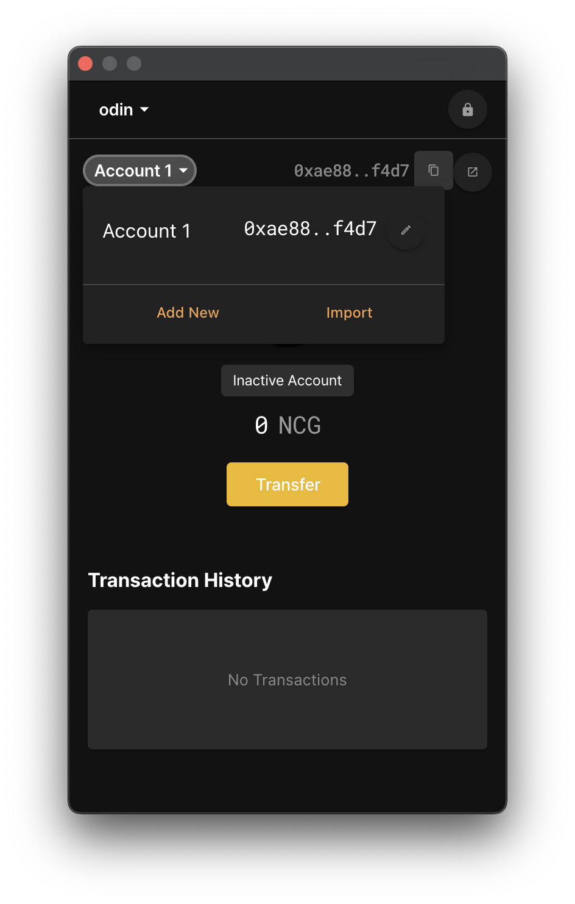
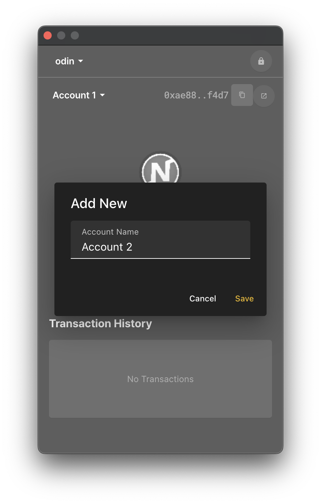
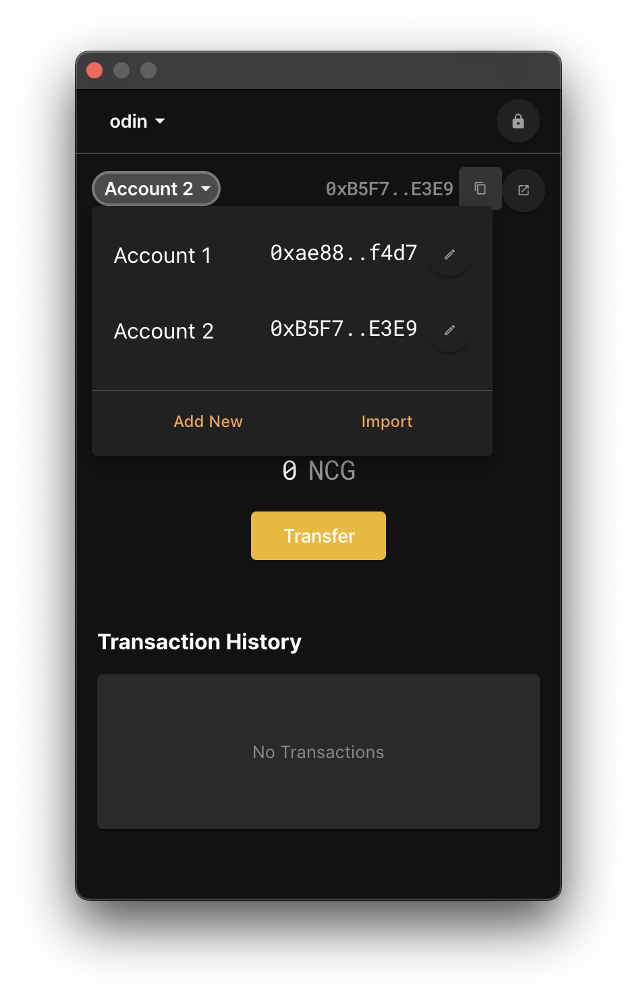
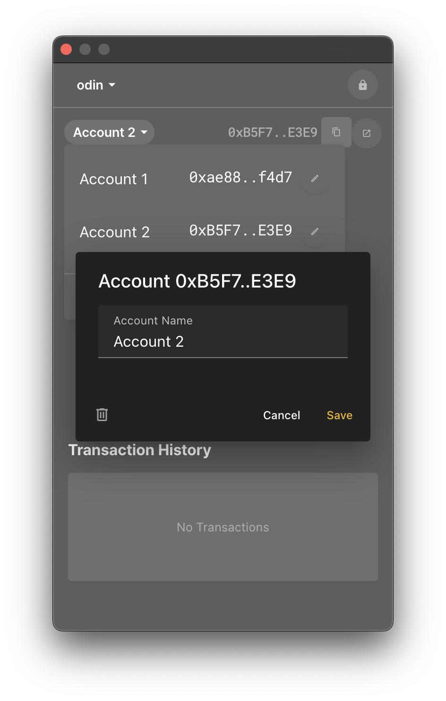
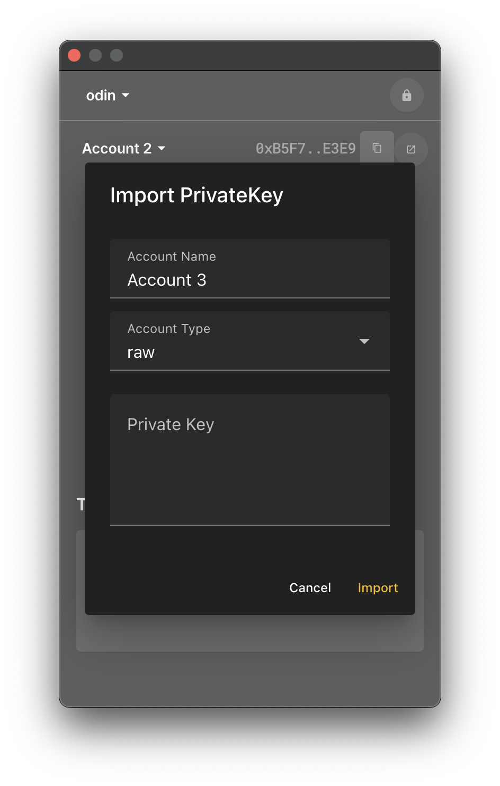
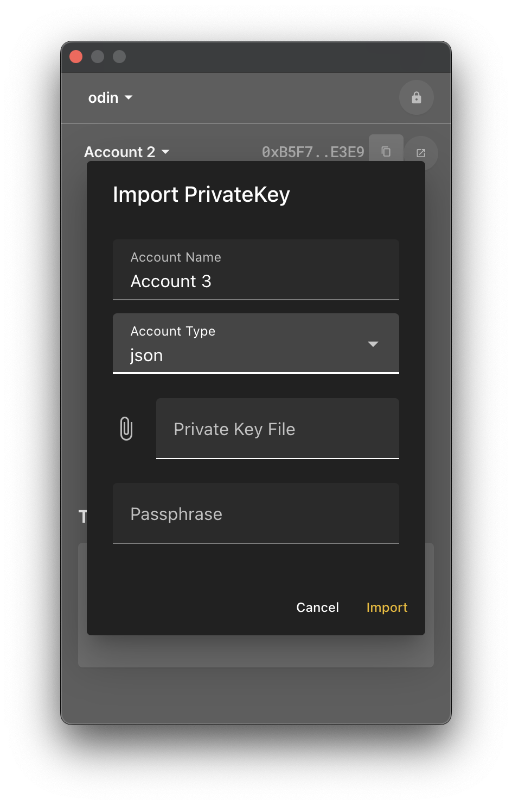
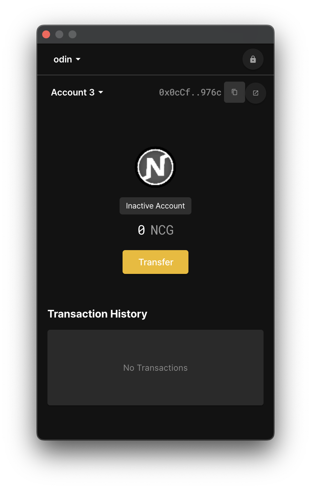

# Account

When you're all set up, you should see something like this.

Look in the top left corner where it says “Account 1”. Click on it, and you'll see a list of posts like this, and you can choose from them. 

Click the 'Add New' button and you should see something like this.  This is the part where we add a new account, so let's call it 'Account 2' and hit the 'Save' button.

After a few moments, the popup will close and you'll be back to the original screen. Click on the 'Account ...' button in the top left corner. in the top left corner to see that we have created a new account called 'Account 2'.

We just named it 'Account 2', but you can rename it if you like by pressing the pencil icon button to the right of the account list to enter the edit page. For example, if it's an account that you're only using on the Heimdall network, you might want to rename it 'Heimdall', or if it's an account you created for testing, you might want to name it something like 'test'.

You can also delete your account by pressing the button with the trash can icon in the bottom left corner. But I don't think you'll need to do that much.

We're not going to do anything further, so let's hit the Cancel button to close the popup. It will also close on its own if you press off-screen.

If you've played the Nine Chronicles game, or done any development with Libplanet, you should already have a private key, which is stored in JSON. Let's import that key. Tap the list of accounts and hit the 'Import' button.

If you have your private key as a hex string instead of JSON, you can enter it in the 'Private Key' text field and hit the 'Import' button. In the above case, you probably have your key in JSON format. Select 'json' for 'Account Type' and you should see a screen like the one below.

In the 'Private Key File' field, you'll need to insert your JSON key file, and in the 'Passphrase' field, you'll need to enter the password for that key. This is the same password you entered in the launcher when playing Nine Chronicles.

The keyfile is located in the following paths for each platform.

- Windows: `%APPDATA%\planetarium\keystore\`
- macOS/Linux: `~/.config/planetarium/keystore/` (`~` means home directory)
  - In macOS, you should press `CMD+SHIFT+.(DOT)` to show hidden files. (because `.config` is hidden)

If you're a regular Nine Chronicles user, you should have one key file, but if not, you'll need to look up your key ID with a command like `planet key` to select the file.

If you have entered the key file and the password that matches the key file, click the Import button. If it went successfully, you should have an account named 'Account 3'.

