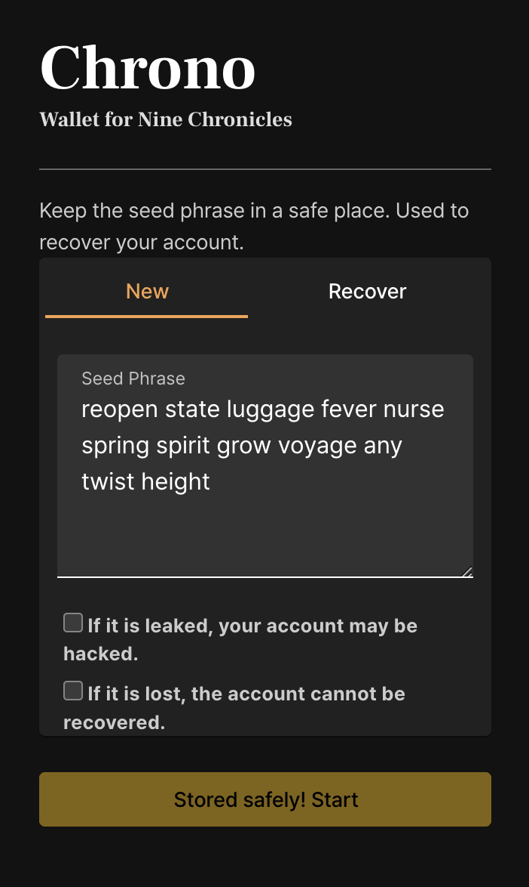
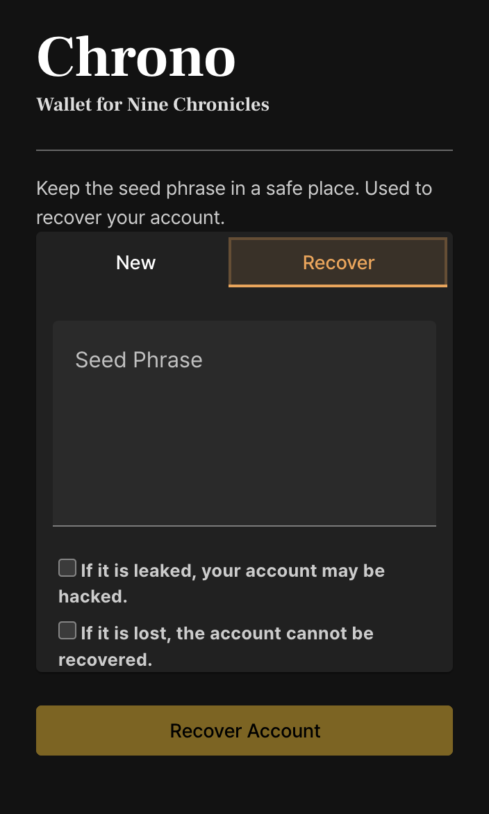

# Initialize

When you first install Chrono, you should see a screen like this: Specify a password to encrypt your key. This will be used later during the login process.

 

After you set your password, you'll be taken to the next screen. This is the screen where you'll create a new account. The English words you see on the screen are mnemonic codes, which are essential for recovering your keys later. Make sure to back them up.

If you have a mnemonic code that you've previously installed and recovered, head over to the 'Recover' tab and enter it to recover it!

