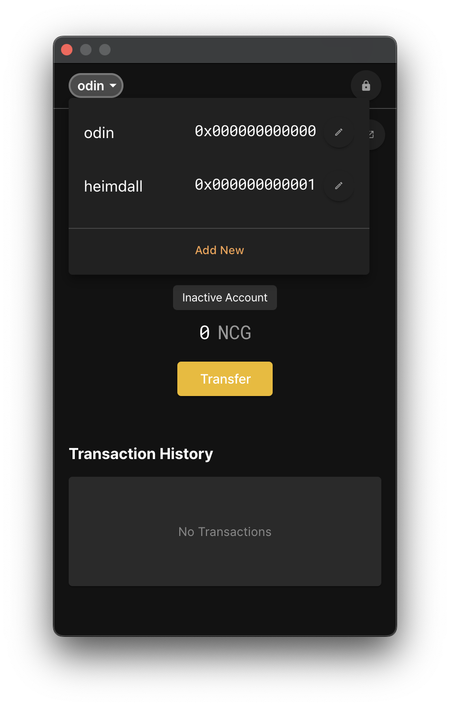
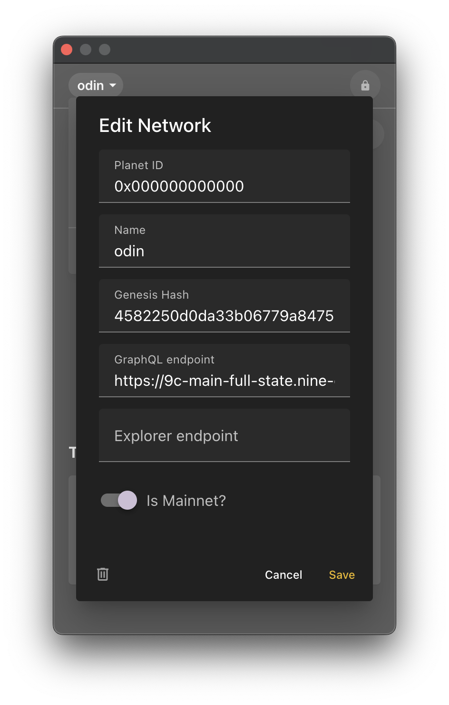
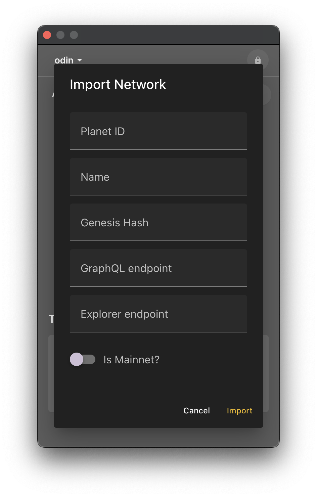

# Network

Next, let's see about a network.

In the top left corner you will see the text 'odin', click on it to see a list of networks. A network defines which RPC nodes will send transactions, get NCG holdings, and sign transactions from which networks. If you select the other default value, 'heimdall', we will query the RPC nodes defined in 'heimdall' to get the values and ask the RPC nodes to propagate the transaction to the network.

If you want to use a different RPC node, you can utilize the network modification feature. When you open the list of networks, you'll see a pencil icon button to the left of the network name. Clicking it will bring up a popup to modify it. As mentioned, if you want to change the RPC node, edit the 'GraphQL endpoint' part. Just like with accounts, you can delete a network by hitting the trash can icon in the bottom left corner.

If you want to add a new network, you can click the 'Add New' button at the bottom of the network list to open a popup to add a network. Fill in the fields and click the 'Import' button to add the network.

